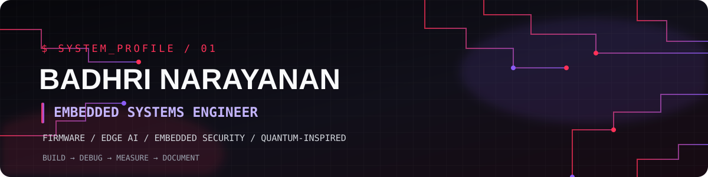
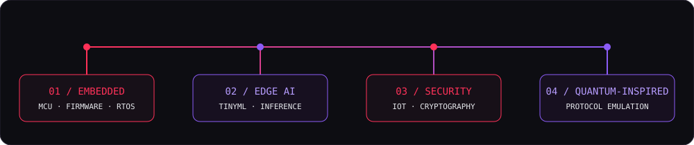
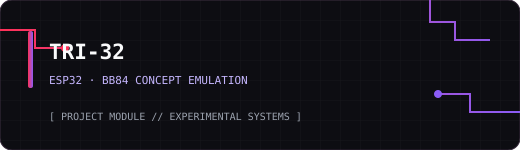
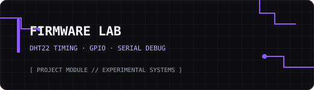
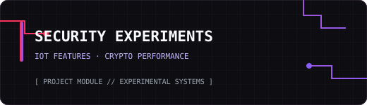
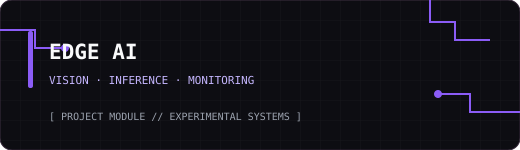
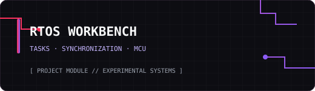
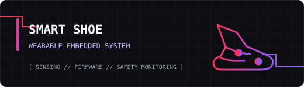

<!--
  BADHRI NARAYANAN — ORIGINAL PROFILE README
  Theme: Black / Crimson Red / Electric Purple
  Replace any placeholder links and remove any project you cannot currently demonstrate.
-->

 

  

---

## Hey, buddies! 👋

I'm **Badhri**, an Electronics and Communication Engineering student who enjoys building things that connect firmware with real hardware.

I spend my time experimenting with microcontrollers, learning how drivers and RTOS-based systems work, debugging communication and timing issues, and exploring what happens when embedded devices meet Edge AI and security. I’m also curious about quantum-inspired computing, which I explore through classical hardware demonstrations such as TRI-32.

This profile is my engineering workbench — projects I’ve built, experiments I’m working through, and lessons I pick up along the way. Some projects are complete; others are still in progress, and I’ll label them honestly.

**My build loop:** `Build → Debug → Measure → Document`

## `domains/`

<table>
<tr>
<td width="50%" valign="top">

### 

- Embedded C / C++
- ESP32, STM32, Renesas EK-RA8D1
- GPIO, UART, I²C, SPI, ADC, PWM
- RTOS concepts and task communication
- Peripheral drivers and hardware debugging

</td>
<td width="50%" valign="top">

### 

- TinyML and on-device inference
- OpenCV and computer vision
- Model evaluation and feature engineering
- Edge AI monitoring prototypes
- Resource/performance-aware experiments

</td>
</tr>
<tr>
<td width="50%" valign="top">

### 

- IoT and embedded security experiments
- Firmware authentication concepts
- Resource-aware post-quantum security research
- QBER-based anomaly detection in TRI-32
- Measurement of latency and memory overhead

</td>
<td width="50%" valign="top">

### 

- BB84 protocol concepts
- Classical hardware emulation with ESP32 nodes
- Alice / Bob / simulated Eve workflow
- Basis matching and QBER demonstrations
- Quantum-inspired algorithm exploration

</td>
</tr>
</table>

## `selected-projects/`

<table>
<tr>
<td width="50%" valign="top">

### [TRI-32 · Embedded QKD Emulator](https://github.com/badhrinarrayanan/TRI-32-Embedded-Quantum-Emulator)

Three ESP32-based roles demonstrate BB84-inspired basis matching, a shared demonstration key, simulated interception, and QBER monitoring. This is a **classical hardware emulation**, not real quantum communication.

`ESP32` `ESP-NOW` `OLED` `QBER`

[**View source code →**](https://github.com/badhrinarrayanan/TRI-32-Embedded-Quantum-Emulator)

</td>
<td width="50%" valign="top">

### DHT22 · From-Scratch Driver

**Status: In progress.** I'm learning to implement the DHT22 timing and protocol flow without relying on a sensor library, including start signalling, response timing, bit decoding, and serial debugging.

`ESP32` `PlatformIO` `GPIO timing` `C++`

</td>
</tr>
<tr>
<td width="50%" valign="top">

### [TinyML · Adaptive IoT Security](https://github.com/badhrinarrayanan/TinyML-Based-Adaptive-Security-Framework-for-Resource-Constrained-IoT-Networks)

An experimental pipeline exploring network-feature extraction, threat classification, and adaptive security policies for constrained IoT devices. The work includes performance comparisons for conventional and post-quantum cryptographic operations.

`ESP32` `Python` `scikit-learn` `IoT security`

[**View repository →**](https://github.com/badhrinarrayanan/TinyML-Based-Adaptive-Security-Framework-for-Resource-Constrained-IoT-Networks)

</td>
<td width="50%" valign="top">

### [Edge AI · Honeybee Monitoring](https://github.com/badhrinarrayanan/Edge-AI-Honeybee-Monitoring)

An Edge-AI monitoring project exploring computer-vision and machine-learning techniques for observing honeybee-hive activity. Add implementation details and results that match the current repository.

`Python` `OpenCV` `TensorFlow/Keras`

[**View repository →**](https://github.com/badhrinarrayanan/Edge-AI-Honeybee-Monitoring)

</td>
</tr>
<tr>
<td width="50%" valign="top">

### FreeRTOS · Embedded Experiments

**Status: Learning / in progress.** Practising task scheduling, task states, synchronization, notifications, and sensor/status processing on microcontroller development boards.

`FreeRTOS` `C` `STM32` `Debugging`

</td>
<td width="50%" valign="top">

### [Smart Shoe · Wearable Safety System](https://github.com/badhrinarrayanan/smart-shoe-monitoring-system)

A wearable embedded-system project focused on shoe-integrated sensing and safety-oriented monitoring. Update this summary to reflect the actual sensors, functions, and test results in your implementation.

`Embedded Systems` `Sensors` `Wearable Technology`

[**View repository →**](https://github.com/badhrinarrayanan/smart-shoe-monitoring-system)

</td>
</tr>
</table>

## `toolchain/`

  

## `github/telemetry`

 

 

> Stats cards are provided by third-party services. They may load slowly, have uptime limits, or occasionally fail. GitHub language statistics describe repository code, not your full skill level.

## `currently-building/`

- Strengthening Embedded C, MCU peripherals, and RTOS fundamentals.
- Practising firmware-level timing and protocol debugging.
- Exploring resource-aware security for constrained IoT devices.
- Documenting experiments with measurements, limitations, and reproducible steps.

## `connect/`

  

<code>/* Make it work. Understand why. Measure what matters. */</code>

